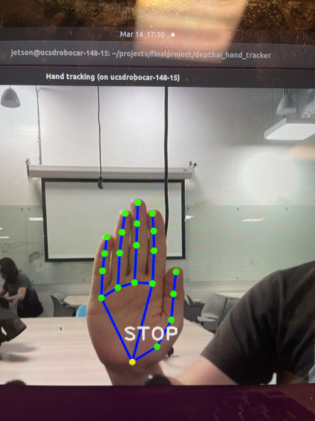
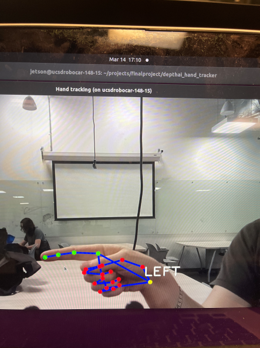
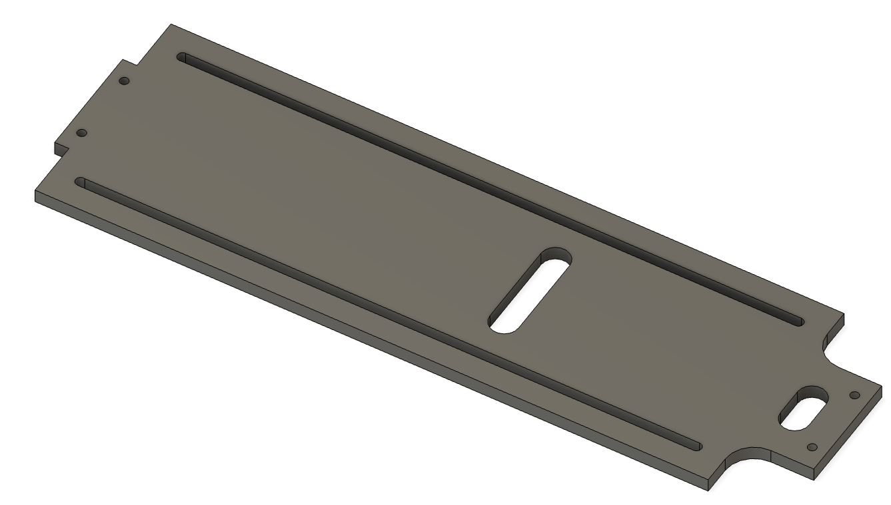
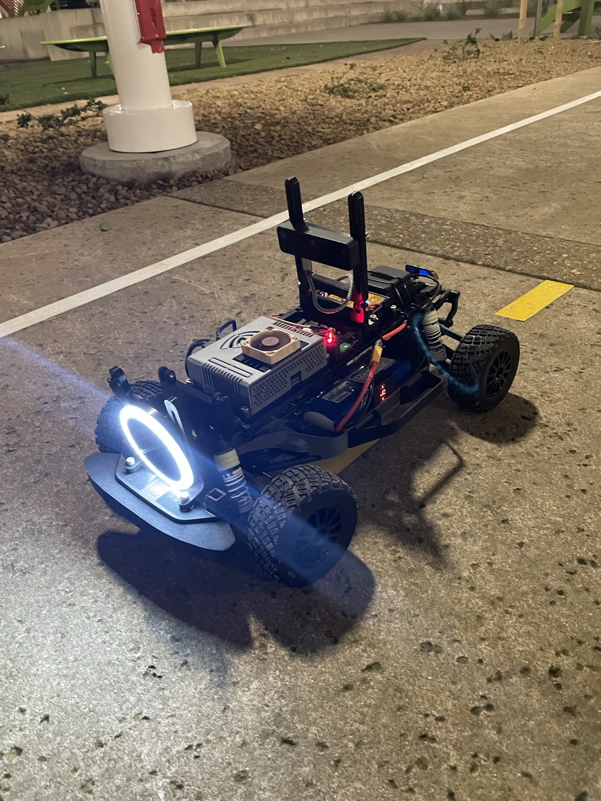
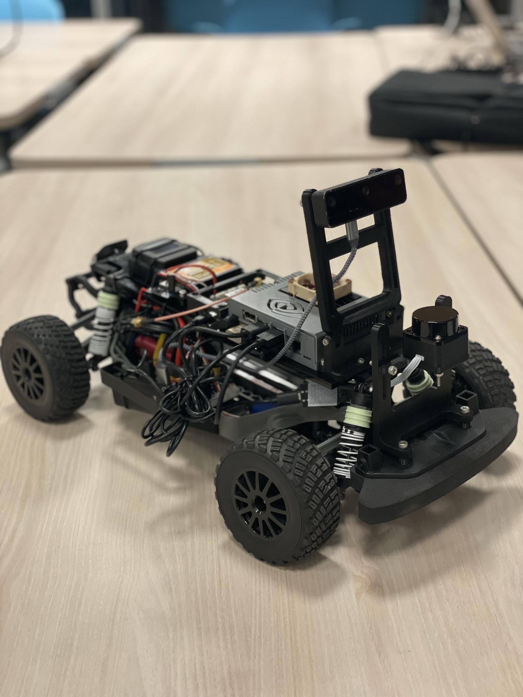

# Final Project Repository for Team 15 of the 2023 Winter Class MAE ECE 148 at UCSD
Our Final Project uses the AI controlled autonomous vehicle developed in early course sections to implement a driving protocol based on hand signals. To do this, we utilize the GPS-tracking and following code developed/given in class, and combined it with the DepthAI gesture recognition software pack. Our idea developed from our interest in the OAK-D Lite camera’s stereo vision system and ability to run DepthAI within the camera for processing. To use both of these functions, we chose to run a hand detection program that uses Google Mediapipe to combine these features in a unique project that no one on our team had tried before. 

Below are examples of how our hand detection tracker will recognize our gestures

## **Car Physical Setup**
Our car setup used a large piece of acrylic to connect across the RC car strut towers to support all of our electronics. The acrylic had two grooves along the entire length that were 3 inches apart, allowing us to reconfigure our electronics layout as the class progressed. We knew we would be given different devices through the length of the class, so this modular setup gave us the ability to adapt to them quickly rather than redesigning everytime.

Our camera setup was originally a rigid mount on the front of the car, but as we tested our initial Donkey Car laps on the outdoor track we recognized the need for adjusting our angle to detect the lines better. This led to our tall hinging mount that gave us better viewing angles that we could set up within seconds for testing.

## **Software**
### depthai software pack
To detect hand gestures, we use the Luxonis DepthAI Software on the Luxonis OAK-D stereo-vision camera. Here, we included custom code to regognize a set of hand gestures: 
- Thumbs-up gesture to activate driving
- Held up flat hand as a stop signal 
- different number of fingers (with the thumb not pointing outwards) changes the speed in a four level control scheme
- pointing the index finger with thumb outstreched left or right to change direction of steering 
### d5 GPS-control
In the d5 subdirectory, we used the donkeycar interfaces to program a simple GPS training and following routine to generate a path for the car to follow. This part of the project is still partly in development, as currently only the speed can be varied with hand signals.
### DonkeyCar software
We use the preconfigured DonkeyCar software package to facilitate control and interfacing of the Jetson nano embedded system with the rest of the RC car. We implemented a special interrupt in the signal chain to be able to pass in different speed values, which are first stored by the modified DepthAI software pack into the file finalproject/comm.txt as a simple string command corresponding to the recognized hand sign. which is then read into the DonkeyCar VESC control subroutine to change the throttle values dynamically. 
## Operation
One can either run the depthai software on its own with the VESC class implemented right in the file demo_bdf.py by just executing it with all lines commented in, or, if it is desired to just utilize the throttle values, comment out the VESC related code, run the demo_bpf.py and then simultaneaously run the d5 donkeycar code with ./python manage.py drive. Then, steering will be controlled by the GPS following algorithm, while the speed is controlled via the detected hand signals.

# **Team 15: Boba Team**
- Reinwei Bai
- Manu Mittal
- Reisandy Lamdjani
- Moritz Wagner
